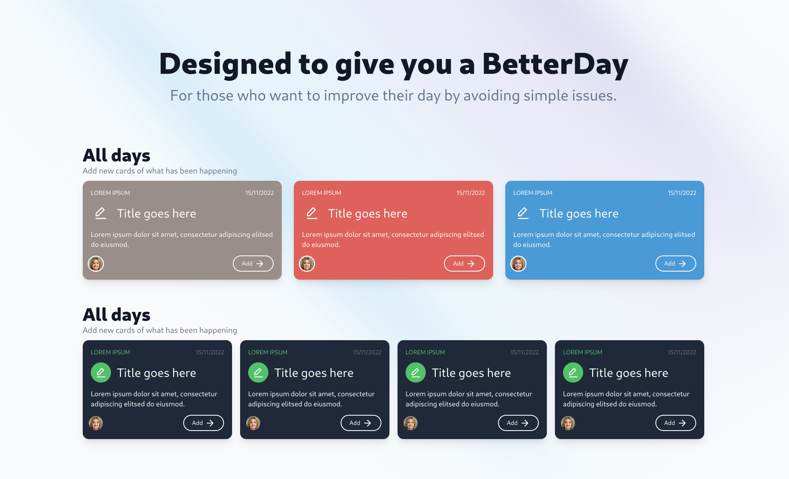

<p>
  <h1 align="center">BetterDay</h1>
</p>

## 📚 Student Details:

- Student number: `22931`
- Student name: `Marcos Oliveira`
- Supervisor: [Pramit Dutta](https://www.linkedin.com/in/pramitd/)
- College: [Dorset College](https://dorset.ie/)

<p align="center">
  
</p>

## 📝 Introduction:

Have you ever had a day or week when it seems that everything does not go the way that you expect? You forgot your car keys, missed the bus, or arrived late for an interview for a new job all while trying to complete everything on your to do list? Nowadays, this happens to everyone because we all seem to be busy all the time. And due to the pressure and strain of this busyness, the simple things in our daily life get forgotten and overtaken by other priorities and distractions. Certainly, we are busier now than decades ago, when no computers, smartphones with social media, or emails constantly interrupted our lives

That is where BetterDay comes in. In order to help people with their daily life, the BetterDay application promises to help the user to solve simple tasks by analysing and understanding the user's daily routine and makes suggestions to help the user to avoid having a similar bad day in the future.

## 🔖 Layout:

To access the layout use [Figma](https://www.figma.com/proto/24iRW0iGFwiTycLkji4Jra/A-badDay?node-id=56%3A38&scaling=scale-down&page-id=0%3A1&starting-point-node-id=56%3A38).

## 💻 How to run this project:

`Web`:
```js
// Using Vite / React:

cd web
npm run dev
```

`Mobile`:
```js
// Using Expo:

cd mobile
npx expo start
```

`Server`:
```js
// Using Prisma Studio / SQLite;
// Go to localhost:5555 to see the database in real time:

cd server
npm run dev
// and
npx prisma studio
```

## 🚀 Front-end:

- [React](https://reactjs.org) - is a JavaScript library for building user interfaces.
- [React Native](https://reactnative.dev/) - is a JavaScript library for building native mobile apps.
- [VitJS](https://vitejs.dev) - is a build tool that aims to provide a faster and leaner development experience for modern web projects.
- [Tailwind](https://tailwindcss.com/) - is a utility-first CSS framework for rapidly building custom user interfaces.
- [PostCSS](https://postcss.org/) - is a tool for transforming CSS with JavaScript.
- [Radix-ui](https://www.radix-ui.com/) - Unstyled, accessible components for building high‑quality design systems and web apps in React.
- [React Icons](https://react-icons.github.io/react-icons/icons?name=md) - is a library of icons for React.
- [Axios](https://www.npmjs.com/package/axios) - helps us to make HTTP requests to our API using Node.
- [Firebase](https://firebase.google.com/) - is a Backend as a Service (BaaS) developed by Firebase, Inc. in 2011, then acquired by Google in 2014.
- [React-Toastify](https://www.npmjs.com/package/react-toastify) - toasts will be displayed once the user signs in, or out, create a card, and the AI generates a new card...

## 🚀 Back-end:

- [NodeJS](https://nodejs.org/en/) - is a JavaScript runtime built on Chrome's V8 JavaScript engine.
- [Express](https://expressjs.com/) - is a web application framework for Node.js.
- [Typescript](https://www.typescriptlang.org/) - is a typed superset of JavaScript that compiles to plain JavaScript.
- [ts-node-dev](https://www.npmjs.com/package/ts-node-dev) - is a tool that helps develop Node.js applications with TypeScript.
- [cors](https://www.npmjs.com/package/cors) - is a node.js package for protecting the API from other domains to access our API.
- [Prisma](https://www.prisma.io/) - is an `Object-Relational Mapping (ORM)` open-source tool for Node.js and TypeScript. It makes it easy to query databases with TypeScript or JavaScript.

  Instead of writing a SQL statement like this:
  ```sql
  SELECT * FROM users WHERE id = 1
  ```

  You can write it like this:
  ```js
  prisma({
    select: {
        title: true,
    },
    where: {
        id: 1
    },
    orderBy: {
        createdAt: 'desc'
    }        
  });
  ```

## 🚀 Database:

- [Node - SQLite3](https://www.npmjs.com/package/sqlite3) using Prisma.

## 🤝 References:
### Web:
- [React Documentation](https://reactjs.org/)
- [React Native Documentation](https://reactnative.dev/docs/environment-setup)
- [Rocketseat Education](https://github.com/rocketseat-education)
- [Tailwind CSS Team Cards](https://tailwindcomponents.com/component/upgrade-team)
- [Authentication in Firebase](https://www.youtube.com/watch?v=Vv_Oi7zPPTw)

### Mobile:
- [Expo Google Fonts](https://docs.expo.dev/guides/using-custom-fonts/)

### Server:
- [Cors Documentation](https://expressjs.com/en/resources/middleware/cors.html)


# Future Implementations

### User:
- A dashboard with image, name, and email;
- Users should be able to edit/delete their information account;

### Card:
- Generate random colours for the cards the user will be creating;
- Each card should have an icon to show the user what kind of card is.
- The first row of the cards, should have a "carrousel" with the cards that the user created.

### Suggested Card:
- Limited the AI to answer just questions related to the user well being.
- Suggested cards should have the same # of cards that the user created.
- Liked icon that works;
- Formate the data type that is displayed in the database.
- The main card could be displaying daily tips. Encouragement words? or things the user has been doing?

## Bugs

### Card:
- If the user doesn't input the days or times, it crashes the system.

### Suggested Card:
- When there are many cards, and when the user clicks the "know more button", it will get the last card created and not the property card itself.
- In the pop-up card that opens when the user clicks on the "know more button", it doesn't display all the information the AI generated.

### Database:
- On Prisma Studio, there aren't enough characters for the AI response, which is why, the suggested card, is missing more text from the AI.


## Extra

### Other tools:
Some tools I can use to create/training the AI:

> https://wit.ai/

> https://dialogflow.cloud.google.com/cx/projects


## ⚠️ Copyright:
Please note, this is my Final Project as a student in `Bachelor of Science in Computing, Year 3`, at `Dorset College`, however, it may contain some part of the code that may be Copyright. All the people were duly referenced in the `"References"` section above.

Please also note that this project is `non-profit` and not intended to be monetized.

---

<strong>Built with 💙 by [@Marcos Oliveira](https://www.linkedin.com/in/pgmarcosoliveira/)</strong>
